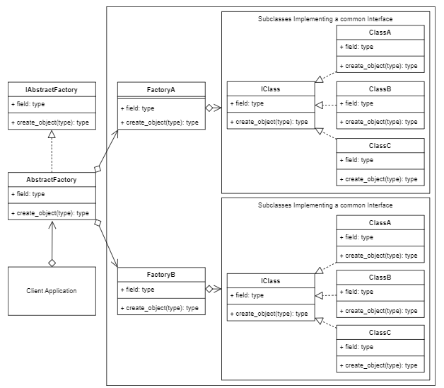
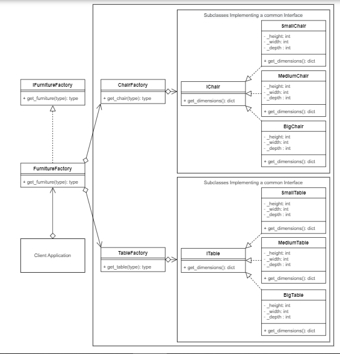

# Abstract Factory Design pattern

The Abstract Factory design pattern provides an interface for creating families of related objects without specifying their concrete classes. It encapsulates object creation logic and allows client code to create objects without knowing the specific classes involved. The pattern consists of an abstract factory interface, concrete factories for each family of products, abstract product interfaces, and concrete product implementations. The client code interacts with the abstract interfaces, decoupling it from the concrete classes. This pattern promotes extensibility and consistency among related objects, making it easier to add new families of products and switch between them.

## Factory UML Diagram

## Terminology

* Client: The client application that calls the Abstract Factory. It's the same process as the Concrete Creator in the Factory design pattern.

* Abstract Factory: A common interface over all the sub factories.

* Concrete Factory: The sub factory of the Abstract Factory and contains method(s) to allow creating the Concrete Product.

* Abstract Product: The interface for the product that the sub factory returns.

* Concrete Product: The object that is finally returned.

## Abstract Factory Example UML Diagram

## Code

### [ abstract Factory Concept  ](./../AbstractFactory/abstract_factory_concept.py)

### [ Factory a  ](./../AbstractFactory/factory_a.py)

### [ Factory b  ](./../AbstractFactory/factory_b.py)

### [ Client  ](./../AbstractFactory/client.py)

### [ Interface Furniture Factory  ](./../AbstractFactory/interface_furniture_factory.py)

### [ Furnitur Factory  ](./../AbstractFactory/furniture_factory.py)

### [ Chair Factory ](./../AbstractFactory/chair_factory.py)

### [ Interface Chair ](./../AbstractFactory/interface_chair.py)

### [ Small Chair  ](./../AbstractFactory/small_chair.py)

### [ Medium Chair  ](./../AbstractFactory/medium_chair.py)

### [ Big Chair  ](./../AbstractFactory/big_chair.py)

### [ Table Factory  ](./../AbstractFactory/table_factory.py)

### [ Interface Table  ](./../AbstractFactory/interface_table.py)

### [ Small Table  ](./../AbstractFactory/small_table.py)

### [ Medium Table  ](./../AbstractFactory/medium_table.py)

### [ Big Table  ](./../AbstractFactory/big_table.py)