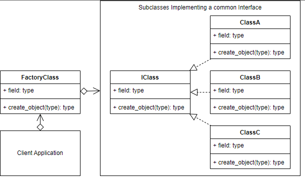
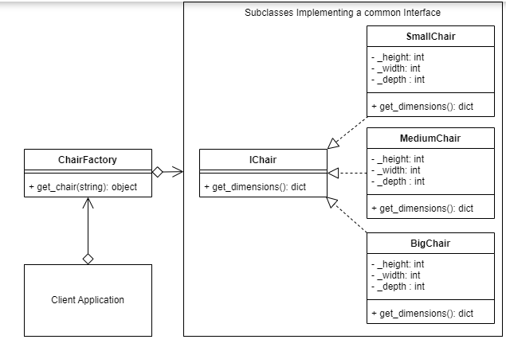

# Factory Design pattern

The Factory Design Pattern is a creational design pattern that provides an interface for creating objects, but allows subclasses to decide which class to instantiate. It promotes loose coupling by abstracting the process of object creation.

The Factory pattern is useful when you have a super class with multiple subclasses and the exact subclass that needs to be instantiated is determined at runtime. It centralizes the object creation logic in a factory class, which can create instances of different subclasses based on specific conditions or parameters.

## Factory UML Diagram

## Terminology

* Concrete Creator: The client application, class or method that calls the Creator (Factory method).

* Product Interface: The interface describing the attributes and methods that the Factory will require in order to create the final product/object.

* Creator: The Factory class. Declares the Factory method that will return the object requested from it.

* Concrete Product: The object returned from the Factory. The object implements the Product interface.

## ABCMeta

ABCMeta classes are a development tool that help you to write classes that conform to a specified interface that you've designed.

ABCMeta refers to Abstract Base Classes.

The benefits of using ABCMeta classes to create abstract classes is that your IDE and Pylint will indicate to you at development time whether your inheriting classes conform to the class definition that you've asked them to.

Abstract interfaces are not instantiated directly in your scripts, but instead implemented by subclasses that will provide the implementation code for the abstract interface methods. E.g., you don't create IChair, but you create SmallChair that implements the methods described in the IChair interface.

An abstract interface method is a method that is declared, but contains no implementation. The implementation happens at the class that inherits the abstract class.

You don't need to use ABCMeta classes and interfaces that you have created in your final Python code. Your code will still work without them.

## Factory Example UML Diagram

## Code

### [ Factory Concept  ](./../Factory/factory_concept.py)

### [ Client  ](./../Factory/client.py)

### [ Interface Chair  ](./../Factory/interface_chair.py)

### [ Chair Factory  ](./../Factory/chair_factory.py)

### [ Small Chair  ](./../Factory/small_chair.py)

### [ Medium Chair  ](./../Factory/medium_chair.py)

### [ Big Chair  ](./../Factory/big_chair.py)
