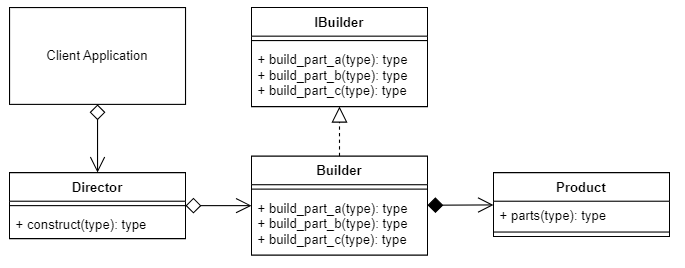
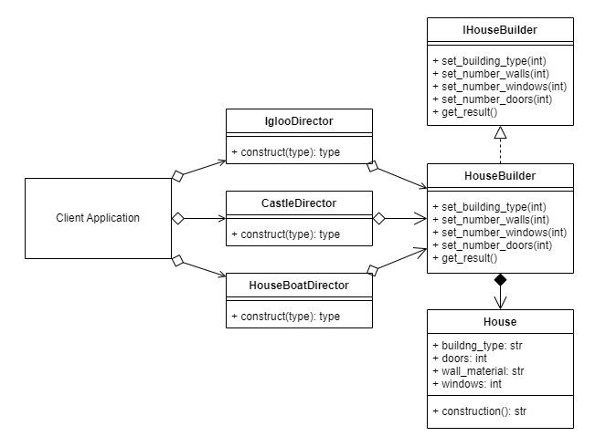

# Builder Design pattern

The Builder design pattern is a creational pattern that separates the construction logic of complex objects from their representation. It allows you to construct objects step by step, using a builder class that provides methods for setting different attributes or properties of the object. The pattern promotes a fluent interface and encapsulates the construction process, making it easy to create different variations of an object without exposing the construction details. The pattern consists of a product class representing the object being built, an abstract builder class defining the construction steps, concrete builder classes implementing the steps, and a director class that controls the construction process. By using the Builder pattern, you can create objects in a more flexible and maintainable way.

## Factory UML Diagram

## Terminology

* Product: The Product being built.
* Builder Interface: The Interface that the Concrete builder should implement.
* Builder: Provides methods to build and retrieve the concrete product. Implements the Builder Interface.
* Director: Has a construct() method that when called creates a customized product using the methods of the Builder.

## Factory Example UML Diagram

## Code

### [ Builder Concept  ](./../Factory/builder_concept.py)

### [ Client  ](./../Factory/client.py)

### [ Castle Director  ](./../Factory/castle_director.py)

### [ House Builder  ](./../Factory/house_builder.py)

### [ House ](./../Factory/house.py)

### [ Houseboat Director  ](./../Factory/houseboat_director.py)

### [ Igloo Director  ](./../Factory/igloo_director.py)

### [ Interface House Builder  ](./../Factory/interface_house_builder.py)
