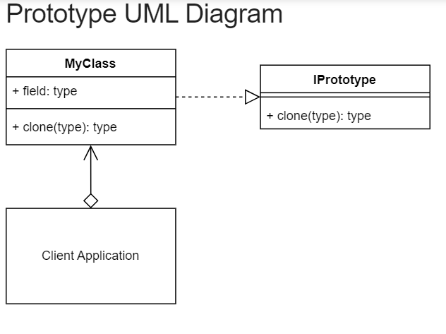
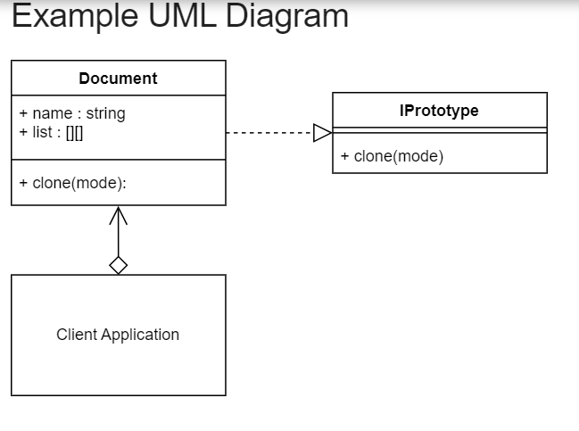

# Prototype Design pattern

The Prototype design pattern is a creational design pattern that enables the creation of new objects by cloning existing instances, rather than creating them from scratch. It eliminates the need for subclassing and reduces the cost of object creation. The pattern involves defining a base class/interface with a clone method, implementing the clone method in concrete classes, creating prototype objects as starting points for cloning, and customizing cloned objects as needed. The Prototype pattern promotes code reusability and flexibility by allowing the creation of objects through cloning, rather than instantiation.

## Prototype UML Diagram

## Prototype Example UML Diagram

## Code

### [ Prototype Concept  ](./../prototype/prototype_concept.py)

### [ document ](./../prototype/document.py)

### [ Client  ](./../prototype/client.py)

### [ Interface Prototype  ](./../prototype/interface_prototype.py)