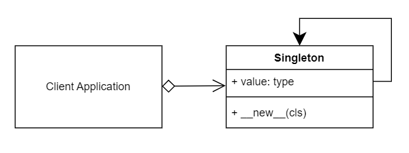
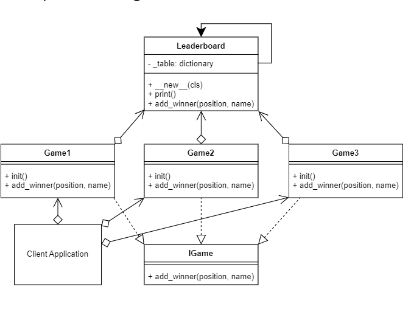

# singleton Design pattern

The Singleton design pattern is a creational design pattern that ensures a class has only one instance, while providing a global point of access to that instance. It is commonly used when there is a need for a single, shared instance of a class throughout an application.

## singleton UML Diagram

## singleton Example UML Diagram

## Code

### [ Prototype Concept  ](./../singleton/singleton_concept.py)

### [ Client  ](./../singleton/client.py)

### [ game1  ](./../singleton/game1.py)

### [ game2  ](./../singleton/game2.py)

### [ game3  ](./../singleton/game3.py)

### [ leaderboard  ](./../singleton/leaderboard.py)

### [ interface_game  ](./../singleton/interface_game.py)
