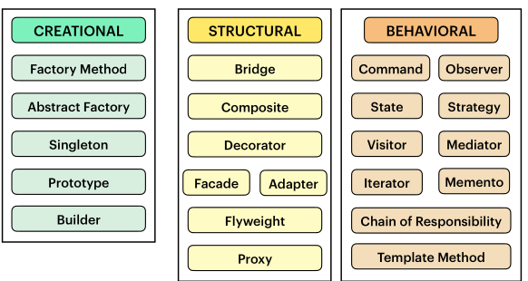

# Design Patterns

• Design patterns are typical solutions to commonly occurring
problems in software design.

• It’s more of general concept for solving problems rather than a
piece of code.

• Design patterns are a more high-level description of a solution.

## Behavioral

The Behavioral Design Patterns focus on how objects interact and communicate with each other, encapsulating behavior and logic.

### 1. Observer

The Observer pattern is useful when:

* One-to-many dependency: When changes in one object should notify and update multiple dependent objects.

* Loose coupling: When you want to decouple objects so they don't need to explicitly refer to each other.

* Event-driven systems: Ideal for implementing event listeners, like GUI components reacting to user actions.

* Broadcast communication: When you need to propagate changes across multiple parts of an application efficiently.

[Code](./Behavioral/Observer/main.py)
